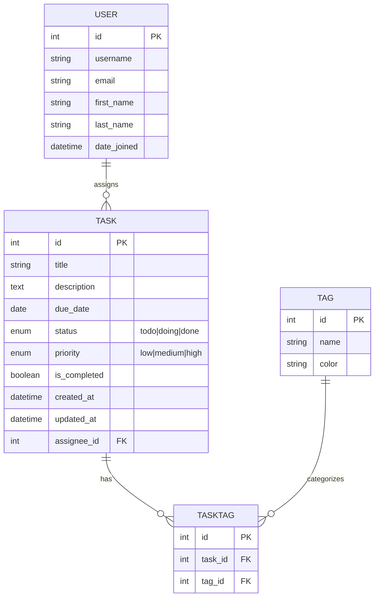

[schema.sql](https://github.com/user-attachments/files/24177871/schema.sql)# 🧩 API Django Sem Front-End

[](https://www.python.org/downloads/)
[](https://www.djangoproject.com/)
[](https://www.django-rest-framework.org/)
[](https://swagger.io/)
[](https://www.sqlite.org/)
[](https://opensource.org/licenses/MIT)

---

## 🏫 Instituições de Fomento e Parceria
[](https://www.ifb.edu.br/)  
[](https://www.hardware.org.br/capacitacao/bfd/inscricao/)  

Projeto Integrador desenvolvido no **IFB - Campus Brasília**, com orientação do professor **Claulis**, e participação no programa **Bolsa Futuro**.

---

## 👨‍🏫 Orientador
[](https://www.linkedin.com/in/claudioulisse/)  
[](https://github.com/claulis)  
[](http://lattes.cnpq.br/4607303092740768)

---

## 📑 Sumário
- [Visão Geral](#visão-geral)
- [Links Importantes](#links-importantes)
- [Pacotes Utilizados](#pacotes-utilizados)
- [Estrutura do Projeto](#estrutura-do-projeto)
- [Diagrama de Banco de Dados](#diagrama-de-banco-de-dados)
- [Documentação da API](#documentação-da-api)
- [Endpoints Principais](#endpoints-principais)
- [Configuração do Ambiente](#configuração-do-ambiente)
- [Deploy](#deploy)
- [Demonstração Visual](#demonstração-visual)
- [Autor](#autor)
- [Licença](#licença)

---

## 📘 Visão Geral
A **API Design Team Flow** é uma API **RESTful** desenvolvida para gerenciar demandas de um time de design e organizar tarefas de forma eficiente.  
Ela permite **criar, listar, atualizar e excluir tarefas (CRUD)**, servindo como backend robusto para:

- **Sistemas Kanban**  
- **Dashboards de produtividade**  
- **Aplicações de gestão de tarefas**  

Este projeto também inclui um **Gerenciador de Tarefas com Django**, demonstrando o uso de **Models, Views e Templates** para criar lógica de negócios visual, como identificar tarefas atrasadas automaticamente.

### 📝 Funcionalidades
- **Listagem de Tarefas:** Exibe todas as tarefas cadastradas no banco de dados.
- **Status Visual:**
  - ✅ **Concluída:** A tarefa aparece riscada e em cinza.
  - 🚨 **Atrasada:** Se a data limite já passou e a tarefa não foi feita, ela é destacada em vermelho.
  - 📅 **Em dia:** Tarefas futuras aparecem com destaque padrão (azul).
- **Painel Administrativo:** Interface pronta do Django para adicionar, editar e excluir tarefas.
- **Documentação Automática:** Endpoints documentados via **Swagger**.

A API foi construída com **Django + Django REST Framework**, garantindo escalabilidade e boas práticas.

---

## 🔗 Links Importantes
- **Repositório GitHub:** [API_Django-Sem-Front-End](https://github.com/Leninn-Marinho-Rodrigues/API_Django-Sem-Front-End)
- **Clone via HTTPS:**  
  ```
  https://github.com/Leninn-Marinho-Rodrigues/API_Django-Sem-Front-End.git
  ```
- **Clone via SSH:**  
  ```
  git@github.com:Leninn-Marinho-Rodrigues/API_Django-Sem-Front-End.git
  ```
- **Codespaces:**  
  [Abrir no Codespaces](https://congenial-space-adventure-q7xqrqg7pg5whxv7.github.dev/)

---

## 📦 Pacotes Utilizados
| Pacote                  | Versão       | Descrição                                      |
|-------------------------|--------------|------------------------------------------------|
| Django                  | 4.2          | Framework web principal                        |
| djangorestframework     | latest       | Toolkit para construção de APIs REST           |
| drf-yasg                | latest       | Geração automática de documentação Swagger     |
| django-cors-headers     | latest       | Controle de acesso HTTP (CORS)                |

> **Nota:** Consulte `requirements.txt` para a lista completa.

---

## 📁 Estrutura do Projeto
```
API_Django-Sem-Front-End/
├── manage.py
├── requirements.txt
├── README.md
├── apps/
│   ├── core/
│   │   ├── models.py
│   │   ├── views.py
│   │   ├── serializers.py
│   │   └── urls.py
└── ...
```

---

## 🗂 Diagrama de Banco de Dados
  

> **D
# Diagrama ER — API Design Team Flow



## Notas de Modelagem
- **USER → TASK (1:N):** um usuário pode ser responsável por várias tarefas (campo `assignee`).
- **TASK ↔ TAG (N:N):** uso da tabela de junção `TASKTAG` para permitir múltiplas tags por tarefa.
- **Status/Priority:** podem ser enums nativos (PostgreSQL) ou `choices` no Django.
- **is_completed & due_date:** suportam a lógica visual (atrasada/em dia/concluída) descrita no projeto.
[Uploading ERD.md…]()
escrição:** Inclua um diagrama gerado por ferramentas como `django-extensions`.

---
No Schema.sql

CREATE TABLE "user" (
    id INTEGER PRIMARY KEY,
    username VARCHAR(150) UNIQUE NOT NULL,
    email VARCHAR(254),
    first_name VARCHAR(150),
    last_name VARCHAR(150),
    date_joined TIMESTAMP NOT NULL
);

CREATE TABLE tag (
    id INTEGER PRIMARY KEY,
    name VARCHAR(50) NOT NULL,
    color VARCHAR(7) -- HEX como '#FF0000'
);

CREATE TABLE task (
    id INTEGER PRIMARY KEY,
    title VARCHAR(200) NOT NULL,
    description TEXT,
    due_date DATE,
    status VARCHAR(10) CHECK (status IN ('todo','doing','done')) DEFAULT 'todo',
    priority VARCHAR(10) CHECK (priority IN ('low','medium','high')) DEFAULT 'medium',
    is_completed BOOLEAN NOT NULL DEFAULT FALSE,
    created_at TIMESTAMP NOT NULL,
    updated_at TIMESTAMP NOT NULL,
    assignee_id INTEGER,
    FOREIGN KEY (assignee_id) REFERENCES "user"(id)
);

CREATE TABLE tasktag (
    id INTEGER PRIMARY KEY,
    task_id INTEGER NOT NULL,
    tag_id INTEGER NOT NULL,
    FOREIGN KEY (task_id) REFERENCES task(id) ON DELETE CASCADE,
    FOREIGN KEY (tag_id) REFERENCES tag(id) ON DELETE CASCADE,
    UNIQUE (task_id, tag_id)
);
ding schema.sql…]()


## 📚 Documentação da API
- **Swagger UI:**  
  ```
  http://127.0.0.1:8000/swagger/
  ```
- **Redoc:**  
  ```
  http://127.0.0.1:8000/redoc/
  ```

---

## 🔗 Endpoints Principais
| Método | Endpoint              | Descrição                          | Autenticação |
|--------|-----------------------|------------------------------------|--------------|
| GET    | `/api/items/`         | Lista todos os itens               | Opcional     |
| POST   | `/api/items/`         | Cria um novo item                  | Requerida    |
| GET    | `/api/items/{id}/`    | Recupera um item específico        | Opcional     |

---

## ⚙️ Configuração do Ambiente
1. **Clone o repositório:**
   ```bash
   git clone git@github.com:Leninn-Marinho-Rodrigues/API_Django-Sem-Front-End.git
   cd API_Django-Sem-Front-End
   ```
2. **Crie o ambiente virtual:**
   ```bash
   python -m venv venv
   source venv/bin/activate   # Linux/Mac
   venv\Scripts\activate      # Windows
   ```
3. **Instale dependências:**
   ```bash
   pip install -r requirements.txt
   ```
4. **Aplique migrações e inicie servidor:**
   ```bash
   python manage.py migrate
   python manage.py runserver
   ```

---

## 🚀 Deploy (Opcional)
- Plataforma recomendada: **Render / Railway**
- Configure variáveis de ambiente e execute:
```bash
python manage.py migrate
python manage.py collectstatic
```

---

## 📸 Demonstração Visual
Aqui estão algumas capturas de tela mostrando o funcionamento da aplicação:

### ✅ Tela Inicial da API

Imagem com teste criando tarefa:


### ✅ Swagger

https://swagger.io/docs/open-source-tools/swagger-ui/usage/installation/


### ✅ Painel Administrativo


> **Dica:** Salve suas imagens na pasta `docs/screenshots/` e atualize os nomes nos links acima.

---

## 👨‍💻 Autor
**Leninn Marinho Rodrigues**  
[](https://www.linkedin.com/in/leninn-marinho-rodrigues-a0b794170/)  
[](https://github.com/Leninn-Marinho-Rodrigues)

---

## 📄 Licença
Este projeto está sob a licença MIT. Veja [LICENSE](LICENSE) para mais detalhes.
